# 동작 예시 (화면 캡처)

> 이미지는 같은 폴더의 `img/` 참조. (동영상은 제출 범위 외)

**관련 문서 (에이전트 정의 3-세트):** [① Mandate](산출물_9_Mandate.md) · [② Context](산출물_10_Context.md) · [③ Directive](산출물_11_Directive.md) · [데모 화면배치](산출물_8_데모_화면배치.md)

## 1. 로그인 → 대시보드
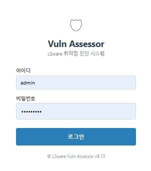
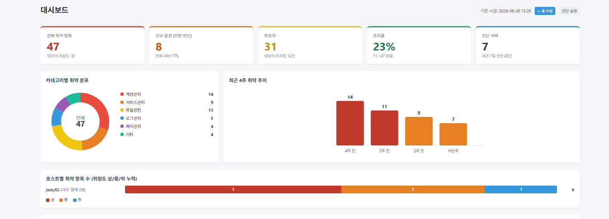
- 로그인 후 대시보드에서 **실제 진단 데이터 기반** 현황을 한눈에 확인 (대상 서버 servers.csv 기준).
- **KPI**: 전체 취약 항목 · 신규 발견(이번 진단) · 미조치 · 조치율 · 진단 서버 수(최근 7일 진단 건수).
- **카테고리별 취약 분포**(도넛): AI 분류를 상위 6개 + 기타로 통합, 항목별 건수·비율(%).
- **최근 4주 취약 추이**(막대): discovered_at 주별 집계, 스케일 눈금선으로 증감 비교.
- **호스트별 취약 항목 수**: 서버별 위험도 상/중/하 누적 막대.
- *(모두 실집계 — KPI·차트·호스트 통계가 진단 결과에서 자동 산출.)*

## 2. 자동 수집 관리 (대상 서버)
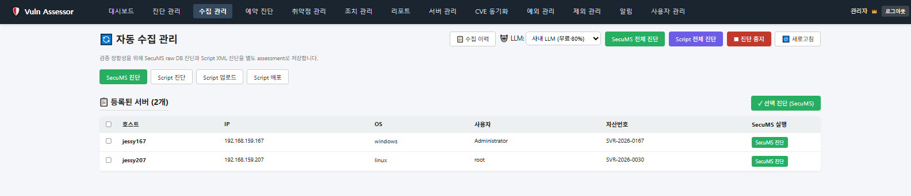
- SecuMS raw DB 진단과 Script XML 진단을 **별도 assessment로 저장**해 정합성 검증에 사용.
- SecuMS 진단 / Script 진단 / Script 업로드·배포, 전체·선택·개별 진단 지원.

## 3. 수집 / 진단 이력
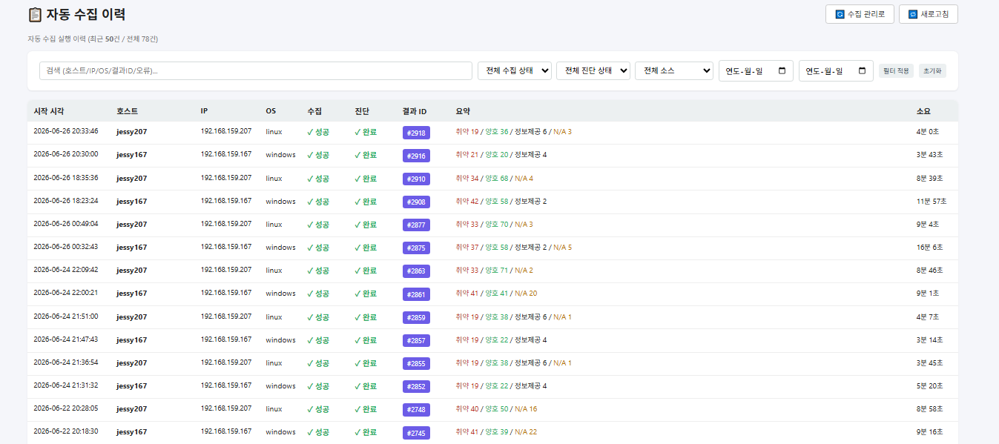
- 서버별·소스별(SecuMS / Script)·유형별(AI / LLM) 이력. 취약/양호/정보/N/A 집계·소요시간·검증 실패율, 최신순.

## 4. ① SecuMS raw data 진단
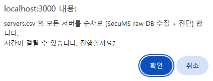
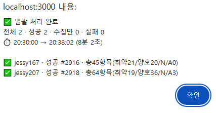
- SecuMS 원본 데이터를 AI/LLM이 독립 판정. 완료 팝업: 전체/성공/실패 + 시작→종료 소요시간.

## 5. ② Script 진단
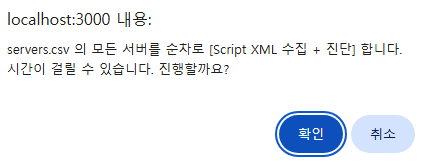
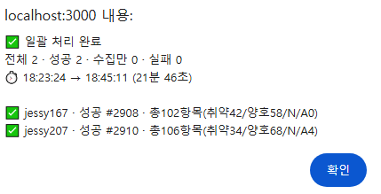
- servers.csv 대상에 자체 수집 스크립트(sh/ps1) 배포·수집·AI 판정. 진행 중 중지 가능.

## 6. 진단 리포트
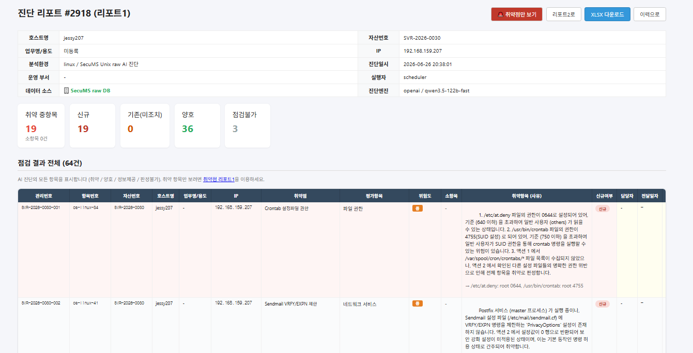
- 헤더: 호스트/자산번호/IP/분석환경/진단일시/실행자. 요약 카드(취약/신규/기존/양호/점검불가).
- 항목별 취약원·평가항목·위험도·사유, **취약점만 보기**·**XLSX 다운로드**, 항목별 **사후 예외** 신청.

## 7. 리포트1 (금융보안원 점검 양식)
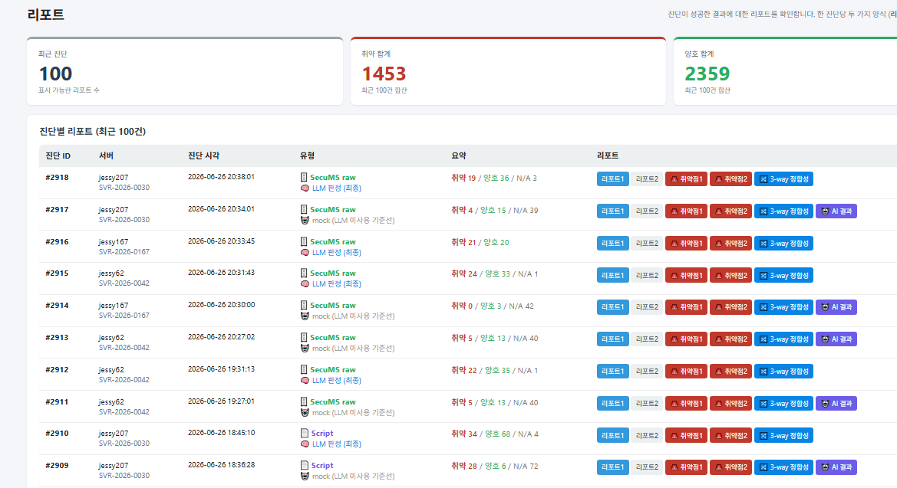
- 2026 금융보안원 전자금융기반시설 OS 점검 양식(확인방법·기준·조치법 포함).

## 8. CVE 자동 진단
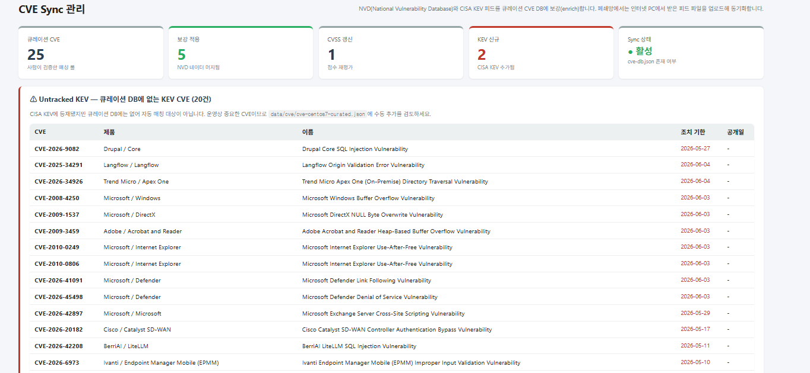
- rpm 인벤토리(Linux)/핫픽스(Windows) 기반 **결정론적·무료** CVE 매칭. KEV 포함 실제 취약(EternalBlue/Zerologon/PrintNightmare, sudo Baron Samedit 등).

## 9. ①②③ 3-way 정합성
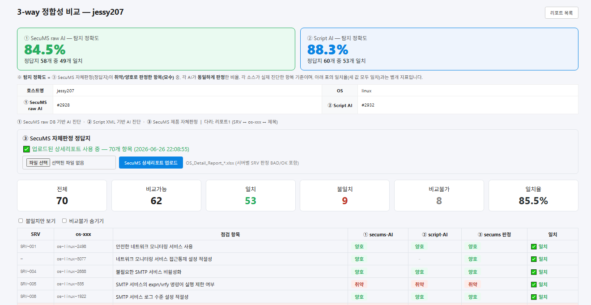
- 상단 **정합성**: ① SecuMS-AI · ② Script-AI 각각 "정답지 N개 중 M개 = X%".
- 항목별 ① SecuMS-AI · ② Script-AI · ③ SecuMS 자체판정(정답지) 나란히 비교, 불일치만 보기.

## 10. 서버 관리 (서버 상태 현황)
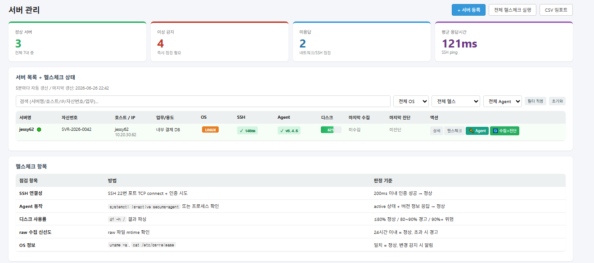
- 대상 서버(servers.csv) 목록 + 상태·리소스 실수집. **에이전트리스 — SSH(Linux)/WinRM(Windows).**
- 상단 KPI: 정상 서버 / 이상 감지 / 미응답.
- 컬럼: 호스트명 · IP · OS · **상태(🟢 Running / 🔴 Stopped)** · CPU · 메모리 · 디스크 · 마지막 수집 · 마지막 진단 · 액션.
  - CPU/메모리/디스크는 **사용률(%) + 절대값**으로 표시 — 예: 메모리 `2.7 / 4.0 GB`, 디스크 `23 / 39 GB`, CPU `1.7GHz · 4코어`.
  - **컬럼별 검색**(호스트명은 Contains/Exact match), **컬럼 클릭 정렬**(▲▼), **5분 자동 갱신 옵션**, **CSV 다운로드**.
- 액션 = **원클릭 배치**: 헬스체크 / 스크립트 배치(배포→수집→진단) / raw data 배치(SecuMS raw 수집→진단).

**지표 정의 및 판정 기준 (실수집):**
| 항목 | 측정 방법 | 판정 기준 |
|---|---|---|
| 디스크 사용률 | Linux `df /`(루트) / Windows `C:`(시스템 드라이브) | ≤80% 정상 / 80~90% 경고 / 90%+ 위험 |
| CPU 사용률 | `vmstat`(Linux) / `Win32_Processor`(Windows) | ≤80% 정상 / 80~90% 경고 / 90%+ 위험 |
| 메모리 사용률 | `free`(Linux) / `Win32_OperatingSystem`(Windows) | ≤80% 정상 / 80~90% 경고 / 90%+ 위험 |
- *(상태·CPU·메모리·디스크 모두 SSH/WinRM 실수집. 상태는 데몬 가동(Running/Stopped) 기준.)*

## 11. 예약 진단 (자동 점검 스케줄)

- cron 기반 자동 점검 스케줄. 대상 서버는 servers.csv 기준 **전체 / 개별 호스트 선택**(OS별 그룹 체크박스).
- 활성 토글 · 즉시 실행 · 편집/삭제 · 다음 실행 시각 자동 계산 · 이번 주 실행 캘린더 · 최근 실행 이력(소요시간 분/초 표기).
- 취약 발견·진단 실패 시 알림 연동. *(데이터는 실데이터 기준 — 가짜 시드 제거, jessy62 제외.)*

## 12. 알림 관리

- 진단/예약 실행 중 이벤트(취약 발견·실패 등) 발송 이력. 채널: console(기본) / 이메일(SMTP) / Slack Webhook (환경변수로 설정).
- KPI: 전체 · 최근 24h · 7일 · 발송 실패 · Error. 테스트 알림 발송 지원. *(샘플/가비지 제거, 실제 발송 이력만 표시.)*

## 13. 취약점 / 조치 관리 (워크플로)
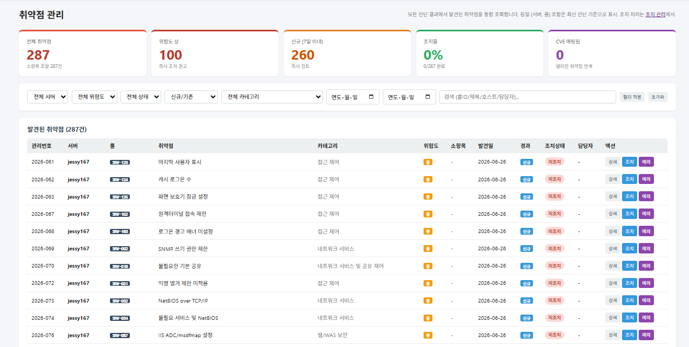
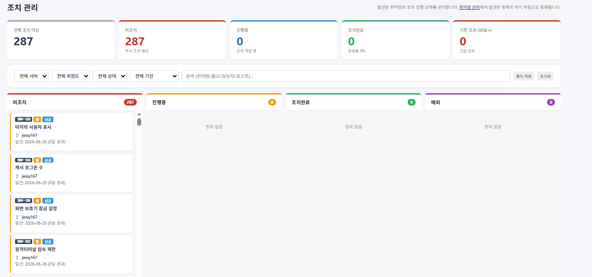
- AI 진단 취약점이 관리 화면에 연동. 조치 워크플로(미조치→진행→완료, **조치일·항목 기록**).

## 14. 예외 관리

- **목록**: KPI(전체·활성·승인대기·만료임박·만료됨) + 검색(룰ID/호스트/사유/신청자·상태·기간).
- **신청 폼**: 제목 · 정책 · OS · **관련 근거(감사추적·필터용)** + **점검항목 다중 선택**(SRV 코드 검색) + 호스트/계정. CISO 승인 후 효력, 만료/연장.
- 사전 예외(신청) + 사후 예외(진단 결과 화면의 [예외] 버튼) 지원.

## 15. 제외 관리

- 로직상 제외(오탐·시스템 계정 등). 예: **시스템 계정 패스워드 변경주기** 항목을 진단 대상에서 제외.
- 점검항목 선택 + 호스트/계정 지정.

## 16. 점검현황

- OS별 **점검완료/미점검** 집계 + 호스트 목록(취약점 개수·**준수율(양호/전체)**·점검상태). servers.csv 대상 실데이터.

## 17. 서버별 점검 이력

- 서버별 준수율·최근 점검일 목록. **호스트명 클릭 → 그 서버의 과거 진단 이력**(진단일시·유형(AI/LLM)·소스·소요시간·취약/양호/판정불가·준수율 추이) 상세.
- *(등급은 "양호÷전체 준수율"로 표기 — 자체 등급 산정 아님.)*

## 18. 진단 관리

- 진단 이력(서버·자산번호·유형·소스·소요시간·결과·검증 실패율). KPI(성공/실패/진행중/평균 소요시간)는 **실데이터 집계**. 소요시간은 분·초로 표기.

---

## 향후 과제 (이번 제출 범위 외 — 신규·고도화 기능)
> 아래는 구현됐거나 설계된 신규/고도화 기능으로, 이번 산출물 화면 캡처 범위에는 포함하지 않고 차기 과제로 둔다.
- **추이/비교 화면**: 정합성·취약 추세 차트 + 진단 간 신규/해소 취약 비교 *(구현 완료, 캡처는 차기)*
- **조치 후 재검증(Closed-loop)**: 조치완료 항목을 재진단해 해소 여부 자동 확인
- **감사 로그**: 진단 실행·예외 승인·제외 등록·조치 변경 등 주요 액션 추적
- **예외/제외 관리 고도화**: 점검항목 선택 · 호스트/계정 · CSV/Excel 일괄 import · 검색 · 날짜 필터
- **알림 고도화**: 예외 만료 임박 · 기한초과 미조치 · 신규 취약 자동 알림
- **사내 LLM 운영 안정화**: 타임아웃·재시도·N회 다수결·결과 캐싱 등 견고화
- **신규 항목 자동 점검 AI Agent (Claude Skill 기반)**: SecuMS 미커버 항목의 점검 절차(명령) 자동 생성 → 수집 → 판정
